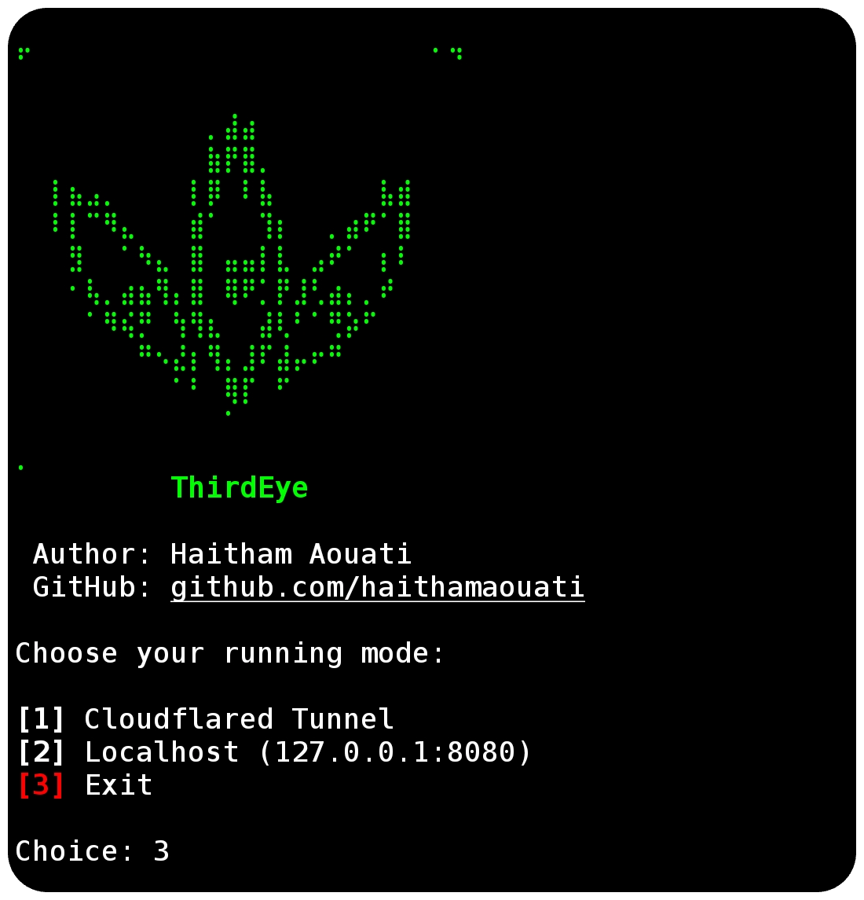

# ThirdEye

**ThirdEye** is a robust, silent camera-monitoring tool. It uses PHP and Cloudflared tunneling to capture real-time PNG images from a target device’s camera.



## Features

- Public & local modes
- Clean logging
- IP & user-agent tracking

## Install

To use the ThirdEye script, follow these steps:

1. Clone the repository:

    ```
    git clone https://github.com/haithamaouati/ThirdEye.git
    ```

2. Change to the ThirdEye directory:

    ```
    cd ThirdEye
    ```
    
3. Change the file modes
    ```
    chmod +x thirdeye.sh
    ```
    
5. Run the script:

    ```
    ./thirdeye.sh
    ```
## Usage

Usage: `./thirdeye.sh`

Choose your running mode:

1. Cloudflared Tunnel
2. Localhost (`127.0.0.1:8080`)
3. Exit

## Dependencies
The script requires the following dependencies:

- **php**: `pkg install php - y`
- **cloudflared**: `pkg install cloudflared -y`

> [!IMPORTANT]  
> Make sure to install these **dependencies** before running the script.

## Environment
- Tested on [Termux](https://termux.dev/en/)

## Disclaimer
>[!CAUTION]
>This Tool is only for educational purposes

> [!WARNING]
> We are not responsible for any misuse or damage caused by this program. use this tool at your own risk!

## License

ThirdEye is licensed under [WTFPL license](LICENSE).
